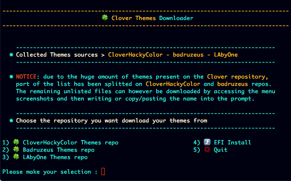
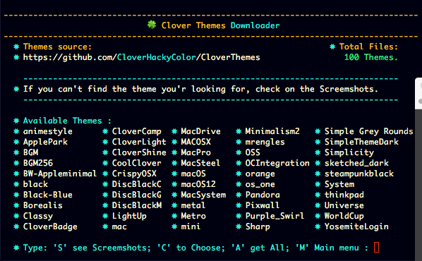

# Clover Themes Downloader

In this particular version (actually working on another)

due to the huge amount of themes present on the Clover repository,

part of the list has been splitted between CloverHackyColor and badruzeus menus.

The remaining unlisted files can however be downloaded by accessing the menu

screenshots and then writing or copy/pasting the name into the prompt.

[My Clover Themes](media/https://github.com/LAbyOne/Clover-Suite-Builder/blob/main/media/Themes.md)

[CloverHackyColor Themes Collection](media/CloverHackyColor%20Themes.md)

##

#

##

[Download](https://github.com/LAbyOne/Clover-Themes-Downloader/releases)

