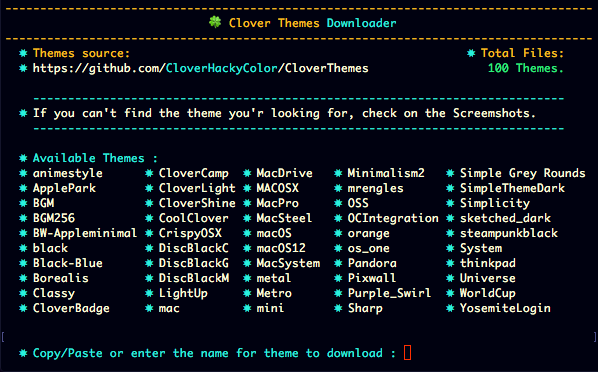
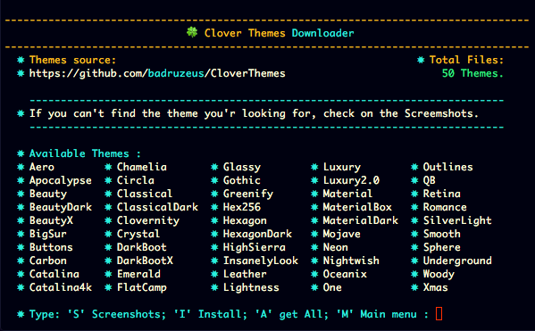
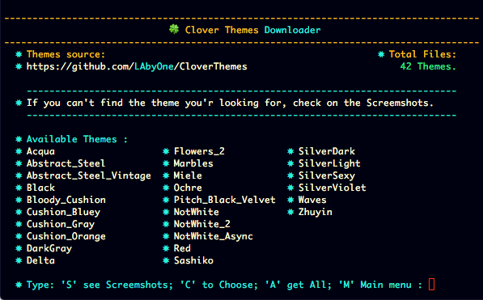

# CloverThemes Downloader

Due to the huge amount of themes present on the Clover repository,

The available themes list has been reduced in order to keep a less confusing experience while using this tool.

And also splitted between CloverHackyColor and badruzeus menus.

The remaining unlisted files can however be downloaded by accessing the menu screenshots and then writing or copy/pasting the name into the prompt.

#

 - Install into EFI, let you install personalized themes you created or modified by yourself
 - Once done you can safely unmount your EFI partition

#

 - For any repo you got to get also screenshots of listed themes available 
 to  download
 

- When selecting "Install" the Download prompt will let you write, or copy/paste, your desired theme

#

#

- eventually just by pressing 'A' key  will download the entire repo. 

#

- The downloaded theme is installed directly into EFI partion and,

- set (if you choose so) as Default

#

 - If for any reason you happen to download a theme already installed
 
 - install will be automatically skipped
 

 
#

[CloverHackyColor Themes Collection](Themes2.md)

[Badruzeus Themes](Themes3.md)

[My CloverThemes](Themes.md)

#

[Back](https://github.com/LAbyOne/CloverThemes-Downloader)
